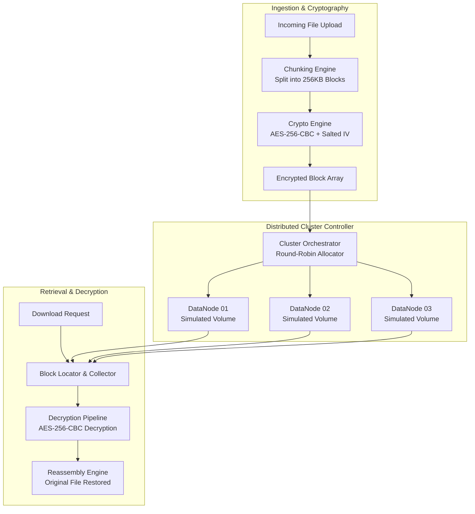

<div align="center">

# ☁️ CloudSecure: Distributed Storage Engine & AES-256 Cloud Controller

### HDFS-Inspired Block Chunking, Cryptographic Encryption, and Simulated Cluster Orchestration

[](https://cloud-secure.vercel.app)
[](https://nodejs.org)
[](https://nodejs.org/api/crypto.html)

<p align="center">
  
  
  
  
  
</p>

*A lightweight distributed cloud controller implementing Hadoop Distributed File System (HDFS) core primitives: file chunking into 256KB blocks, military-grade AES-256-CBC encryption per chunk, round-robin multi-node allocation, and real-time cluster health monitoring.*

</div>

---

## 🌟 Core Architectural Features

- **🧱 HDFS-Style Chunking:** Large files are sliced into uniform 256KB immutable blocks before transmission.
- **🔐 Per-Block AES-256-CBC Encryption:** Independent Initialization Vectors (IV) and cryptographic isolation per block ensure zero cleartext data at rest.
- **🔄 Multi-Node Round-Robin Distribution:** Dispatches blocks across simulated independent DataNodes to emulate real-world distributed fault domains.
- **📊 Real-Time Cluster Dashboard:** Live telemetry tracking storage utilization, block allocation maps, node heartbeats, and cluster health.
- **📱 Fully Responsive UI:** Mobile-optimized layout with overlay sidebar navigation and real-time telemetry.
- **🛡️ Role-Based Access Control:** Secure user & administrator authentication protecting file management and node diagnostics.

---

## 🏗️ Storage Pipeline Architecture



---

## 🚀 Quick Start Guide

### Prerequisites
- Node.js 18.0+
- npm or yarn

### 1. Clone & Install
```bash
git clone https://github.com/Izumi6/cloud-secure.git
cd cloud-secure
npm install
```

### 2. Start the Cloud Controller
```bash
npm start
```
*Open [http://localhost:3000](http://localhost:3000) to access the interactive web controller.*

### Default Login
- **Admin Email:** `admin@gmail.com`
- **Password:** `admin123`
*(Or register a new account instantly via the sign-up form)*

---

## 🔌 RESTful API Specification

| HTTP Method | Route | Description | Auth Required |
|:---|:---|:---|:---:|
| `POST` | `/api/upload` | Chunk, encrypt, and distribute file across nodes | Yes |
| `GET` | `/api/download/:id` | Gather blocks, decrypt, and stream file | Yes |
| `GET` | `/api/files` | Retrieve list of cataloged files | Yes |
| `GET` | `/api/files/:id/blocks` | Inspect block allocation across DataNodes | Yes |
| `DELETE` | `/api/files/:id` | Delete file metadata and wipe encrypted blocks | Yes |
| `GET` | `/api/nodes` | Query health and storage status of DataNodes | Yes (Admin) |
| `GET` | `/api/dashboard` | Cluster-wide performance & allocation metrics | Yes (Admin) |

---

## 🛠️ Technology Stack

| Component | Technology |
|:---|:---|
| **Backend Framework** | Node.js + Express.js |
| **Cryptography** | Node.js Native `crypto` (AES-256-CBC, PBKDF2) |
| **Storage Subsystem** | Simulated multi-node volumes with network latency emulation |
| **Frontend UI** | Vanilla HTML5 / Modern CSS3 / JavaScript |
| **File Handling** | Multer streaming upload parser |
| **Production Hosting** | Vercel Serverless Platform |

---

## 👤 Author

**Suyash Vakhariya**  
- **Portfolio:** [suyashvakhariya.com](https://suyashvakhariya.com)  
- **LinkedIn:** [linkedin.com/in/suyashvakhariya](https://www.linkedin.com/in/suyashvakhariya)  
- **GitHub:** [@Izumi6](https://github.com/Izumi6)  

---

## 📄 License

This project is licensed under the [MIT License](LICENSE).
